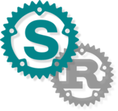

[shadow-rs][docsrs]: compiled project much information
========================================


[![Chrono GitHub Actions][gh-image]][gh-checks]
[![Chrono on crates.io][cratesio-image]][cratesio]
[![Chrono on docs.rs][docsrs-image]][docsrs]

[gh-image]: https://github.com/baoyachi/shadow-rs/workflows/build/badge.svg
[gh-checks]: https://github.com/baoyachi/shadow-rs/actions?query=workflow%3Abuild
[cratesio-image]: https://img.shields.io/crates/v/shadow-rs.svg
[cratesio]: https://crates.io/crates/shadow-rs
[docsrs-image]: https://docs.rs/shadow-rs/badge.svg
[docsrs]: https://docs.rs/shadow-rs


A build script tool compile project much information,version info,dependence info.Like shadow,if compiled,never change.forever follow your project.

When you published a rust binary. Sometimes you need to know the dependencies of the current project.
* Git version information
* which version of rust compiled. 
* Is it a debug or release version of rust.
* Cargo dependent `cargo.lock` detail crates info.
* ...

We can use this information to quickly trace the history version of the project.
n
This project can do this things that can help you quick get above information. let's configuration in your project/.

## example
You can also see [shadow_example](https://github.com/baoyachi/shadow-rs/tree/master/example_shadow) how to configuration.

## step 1
in your `cargo.toml` `packgae` with package add with below config 
```toml
[package]
build = "build.rs"

[build-dependencies]
shadow-rs = "0.3"
```

## step 2
in your project add file `build.rs`,then add with below config 
```rust
fn main() -> shadow_rs::SdResult<()> {
    let src_path = std::env::var("CARGO_MANIFEST_DIR")?;
    let out_path = std::env::var("OUT_DIR")?;
    shadow_rs::Shadow::build(src_path, out_path)?;
    Ok(())
}
```

## step 3
in your project find `bin` rust file.It's usually `main.rs`, you can find `[bin]` file with `Cargo.toml`,then add with below config
```rust
pub mod shadow{
    include!(concat!(env!("OUT_DIR"), "/shadow.rs"));
}
```

## step 4
then you can use const that's shadow build it.
```rust
fn main() {
    println!("{}",shadow::BRANCH); //master
    println!("{}",shadow::SHORT_COMMIT);//8405e28e
    println!("{}",shadow::COMMIT_HASH);//8405e28e64080a09525a6cf1b07c22fcaf71a5c5
    println!("{}",shadow::COMMIT_DATE);//2020-08-16T06:22:24+00:00
    println!("{}",shadow::COMMIT_AUTHOR);//baoyachi
    println!("{}",shadow::COMMIT_EMAIL);//xxx@gmail.com

    println!("{}",shadow::BUILD_OS);//macos-x86_64
    println!("{}",shadow::RUST_VERSION);//rustc 1.45.0 (5c1f21c3b 2020-07-13)
    println!("{}",shadow::RUST_CHANNEL);//stable-x86_64-apple-darwin (default)
    println!("{}",shadow::CARGO_VERSION);//cargo 1.45.0 (744bd1fbb 2020-06-15)
    println!("{}",shadow::PKG_VERSION);//0.3.13
    println!("{}",shadow::CARGO_TREE); //like command:cargo tree

    println!("{}",shadow::PROJECT_NAME);//shadow-rs
    println!("{}",shadow::BUILD_TIME);//2020-08-16 14:50:25
    println!("{}",shadow::BUILD_RUST_CHANNEL);//debug
}
```

## Clap example 
And you can also use const with [clap](https://github.com/baoyachi/shadow-rs/blob/master/example_shadow/src/main.rs#L24_L26).

## Support const table
| const | example |
| ------ | ------ |
| BRANCH | master/develop |
| SHORT_COMMIT | 8405e28e |  
| COMMIT_HASH | 8405e28e64080a09525a6cf1b07c22fcaf71a5c5 |  
| COMMIT_DATE | 2020-08-16T06:22:24+00:00 |
| COMMIT_AUTHOR | baoyachi |
| COMMIT_EMAIL | xxx@gmail.com |  
| BUILD_OS | macos-x86_64 |  
| RUST_VERSION | rustc 1.45.0 (5c1f21c3b 2020-07-13) |  
| RUST_CHANNEL | stable-x86_64-apple-darwin (default) |  
| CARGO_VERSION | cargo 1.45.0 (744bd1fbb 2020-06-15) |  
| PKG_VERSION | 0.3.13 |
| CARGO_TREE | cargo tree |  
| PROJECT_NAME | shadow-rs |  
| BUILD_TIME | 2020-08-16 14:50:25 |  
| BUILD_RUST_CHANNEL | debug/release |  

If you have any question,you can create [issue](https://github.com/baoyachi/shadow-rs/issues/new).
