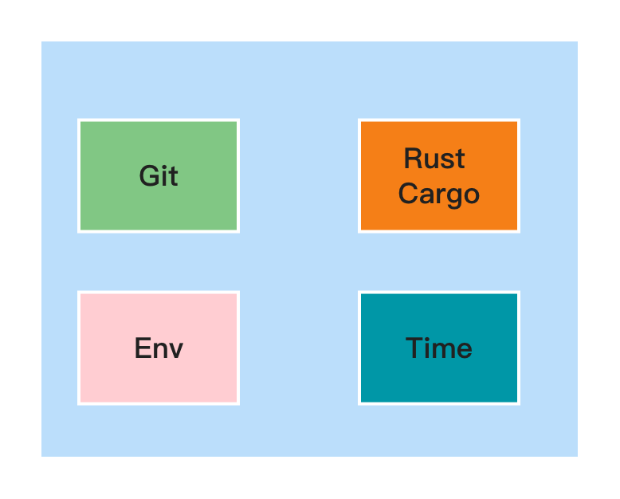

[`shadow-rs`][docsrs]: Build-time information stored in your Rust project (binary, lib, cdylib, dylib).
========================================
<p align="center">
  
</p>

[docsrs]: https://docs.rs/shadow-rs

[](https://github.com/baoyachi/shadow-rs/actions?query=workflow%3Acheck)
[](https://crates.io/crates/shadow-rs)
[](https://docs.rs/shadow-rs)
[](https://crates.io/crates/shadow-rs)
[](https://deps.rs/repo/github/baoyachi/shadow-rs)
[](https://gitter.im/shadow-rs/community?utm_source=badge&utm_medium=badge&utm_campaign=pr-badge)
[](https://coveralls.io/github/baoyachi/shadow-rs)
`shadow-rs` allows you to access properties of the build process and environment at runtime, including:

* `Cargo.toml` information, such as the project version
* Dependency information
* Git information, such as the commit that produced the build artifact
* What version of the Rust toolchain was used in compilation
* The build variant, e.g. `debug` or `release`
* ... And more!

You can use this crate to programmatically check where a binary came from and how it was built.

Currently, integration into **wasm** is also supported. For detailed settings, please refer to the
link [example_wasm](https://github.com/baoyachi/shadow-rs/tree/master/example_wasm).



# Note on Caching

`shadow-rs` build information **is not always rebuilt** when you build a project. `shadow-rs` outputs several hints to
Cargo in order to force rebuilds when required, but this does not always work. You can enforce up-to-date build
information by running `cargo clean` before the build, or use a CI/CD pipeline tool. For more details,
see <https://github.com/baoyachi/shadow-rs/issues/95>.

# Examples

* Check out the [example_shadow](https://github.com/baoyachi/shadow-rs/tree/master/example_shadow) for a simple
  demonstration of how `shadow-rs` might be used to provide build-time information at run-time.
* Check out the [example_shadow_hook](https://github.com/baoyachi/shadow-rs/tree/master/example_shadow_hook) for a
  demonstration of how custom hooks can be used to add extra information to `shadow-rs`'s output.
* Check out the [`builtin_fn` example](https://github.com/baoyachi/shadow-rs/tree/master/examples/builtin_fn.rs) for a
  simple demonstration of the built-in functions that `shadow-rs` provides.

# Setup

### 1) Modify `Cargo.toml` fields

Modify your `Cargo.toml` like so:

```toml
[package]
build = "build.rs"

[dependencies]
shadow-rs = "{latest version}"

[build-dependencies]
shadow-rs = "{latest version}"
```

> About `build = "build.rs"`,this is an optional addition where, by default, build points to the build.rs file. It is
> recommended to use it as such. However, if your build script file is not named build.rs, please manually specify it.
> For
> example: `build = "gen.rs"`.

### 2) Create `build.rs` file

Now in the root of your project (same directory as `Cargo.toml`) add a file `build.rs`:

```rust
fn main() -> shadow_rs::SdResult<()> {
    shadow_rs::new()
}
```

If you want to exclude some build constants, you can use [`new_deny`] instead of [`new`].

### 3) Integrate Shadow

In your main Rust file (usually `main.rs` or `lib.rs`), add this:

```rust
use shadow_rs::shadow;

shadow!(build);
```

The `shadow!` macro uses the given identifier to create a module with that name.

### 4) Use Shadow Constants

You can now use the module defined with `shadow!` to access build-time information.

```rust
fn main() {
    println!("debug:{}", shadow_rs::is_debug()); // check if this is a debug build. e.g 'true/false'
    println!("branch:{}", shadow_rs::branch()); // get current project branch. e.g 'master/develop'
    println!("tag:{}", shadow_rs::tag()); // get current project tag. e.g 'v1.3.5'
    println!("git_clean:{}", shadow_rs::git_clean()); // get current project clean. e.g 'true/false'
    println!("git_status_file:{}", shadow_rs::git_status_file()); // get current project statue file. e.g '  * examples/builtin_fn.rs (dirty)'

    println!("{}", build::VERSION); //print version const
    println!("{}", build::CLAP_LONG_VERSION); //print CLAP_LONG_VERSION const
    println!("{}", build::BRANCH); //master
    println!("{}", build::SHORT_COMMIT); //8405e28e
    println!("{}", build::COMMIT_HASH); //8405e28e64080a09525a6cf1b07c22fcaf71a5c5
    println!("{}", build::COMMIT_DATE); //2021-08-04 12:34:03 +00:00
    println!("{}", build::COMMIT_AUTHOR); //baoyachi
    println!("{}", build::COMMIT_EMAIL); //xxx@gmail.com

    println!("{}", build::BUILD_OS); //macos-x86_64
    println!("{}", build::RUST_VERSION); //rustc 1.45.0 (5c1f21c3b 2020-07-13)
    println!("{}", build::RUST_CHANNEL); //stable-x86_64-apple-darwin (default)
    println!("{}", build::CARGO_VERSION); //cargo 1.45.0 (744bd1fbb 2020-06-15)
    println!("{}", build::PKG_VERSION); //0.3.13
    println!("{}", build::CARGO_TREE); //like command:cargo tree
    println!("{}", build::CARGO_MANIFEST_DIR); // /User/baoyachi/shadow-rs/ |

    println!("{}", build::PROJECT_NAME); //shadow-rs
    println!("{}", build::BUILD_TIME); //2020-08-16 14:50:25
    println!("{}", build::BUILD_RUST_CHANNEL); //debug
    println!("{}", build::GIT_CLEAN); //false
    println!("{}", build::GIT_STATUS_FILE); //* src/lib.rs (dirty)
}
```

#### Reproducibility

This tool includes the current time in the binary which would normally make it non-reproducible.
However, it respects the [`SOURCE_DATE_EPOCH` variable](https://reproducible-builds.org/docs/source-date-epoch/) - if
set to a Unix timestamp it will override the value of build time.

## Clap

You can also use `shadow-rs` to provide information to command-line interface crates such
as [`clap`](https://docs.rs/clap/latest/clap/). An example of this can be found
in [`example_shadow`](https://github.com/baoyachi/shadow-rs/blob/master/example_shadow/src/main.rs).

## List of Constants and Functions

#### Functions

| Function            | Description                                                         |
|---------------------|---------------------------------------------------------------------|
| `is_debug()`        | `true` if this is a build with debug assertions.                    |
| `branch()`          | Git branch at build time.                                           |
| `tag()`             | Current Git tag at build time.                                      |
| `git_clean()`       | Whether Git working tree was clean at build time.                   |
| `git_status_file()` | `git status`-like output, e.g. `  * examples/builtin_fn.rs (dirty)` |

#### Constants

| Constant           | Example                                                                                              |
|--------------------|------------------------------------------------------------------------------------------------------|
| VERSION            | 3.4.5                                                                                                |
| CLAP_LONG_VERSION  | (A multi-line string containing branch, commit hash, build time, Rust version and toolchain channel) |
| BRANCH             | master                                                                                               |
| TAG                | v1.0.0                                                                                               |
| SHORT_COMMIT       | 8405e28e                                                                                             |  
| COMMIT_HASH        | 8405e28e64080a09525a6cf1b07c22fcaf71a5c5                                                             |  
| COMMIT_DATE        | 2021-08-04 12:34:03 +00:00                                                                           |
| COMMIT_DATE_2822   | Thu, 24 Jun 2021 21:33:59 +0800                                                                      |  
| COMMIT_DATE_3339   | 2021-06-24T21:33:59.972494+08:00                                                                     |
| COMMIT_AUTHOR      | baoyachi                                                                                             |
| COMMIT_EMAIL       | xxx@gmail.com                                                                                        |  
| BUILD_OS           | macos-x86_64                                                                                         |  
| BUILD_TARGET       | x86_64-apple-darwin                                                                                  |  
| BUILD_TARGET_ARCH  | x86_64                                                                                               |  
| RUST_VERSION       | rustc 1.45.0 (5c1f21c3b 2020-07-13)                                                                  |  
| RUST_CHANNEL       | stable-x86_64-apple-darwin (default)                                                                 |  
| CARGO_VERSION      | cargo 1.45.0 (744bd1fbb 2020-06-15)                                                                  |  
| PKG_VERSION        | 0.3.13                                                                                               |
| CARGO_TREE         | (Output of `cargo tree`)                                                                             |  
| CARGO_MANIFEST_DIR | /User/baoyachi/shadow-rs/                                                                            |
| PROJECT_NAME       | shadow-rs                                                                                            |  
| BUILD_TIME         | 2021-06-24 21:33:59                                                                                  |  
| BUILD_TIME_2822    | Thu, 24 Jun 2021 21:33:59 +0800                                                                      |  
| BUILD_TIME_3339    | 2021-06-24T15:53:55+08:00                                                                            |  
| BUILD_RUST_CHANNEL | release                                                                                              |  
| GIT_CLEAN          | true                                                                                                 |  
| GIT_STATUS_FILE    | * src/lib.rs (dirty)                                                                                 |  

If you have any questions, please create an [issue](https://github.com/baoyachi/shadow-rs/issues/new) so we may improve
the documentation where it may be unclear.

## People using shadow-rs

If you are using `shadow-rs`, please tell me! Or instead, consider making a note
here: [Shadow Users Collection](https://github.com/baoyachi/shadow-rs/issues/19).

<table>
  <tr>
    <td align="center"><a href="https://github.com/nushell/nushell"><br /><sub><b>nushell</b></sub></a><br /></td>
    <td align="center"><a href="https://github.com/starship/starship"><br /><sub><b>starship</b></sub></a><br /></td>
    <td align="center"><a href="https://github.com/appaquet/exocore">exocore<br /><sub><b>exocore</b></sub></a><br /></td>
    <td align="center"><a href="https://github.com/BaguaSys/bagua-core"><br /><sub><b>bagua-core</b></sub></a><br /></td>
    <td align="center"><a href="https://github.com/alibaba/inclavare-containers"><br /><sub><b>inclavare-containers</b></sub></a><br /></td>

  </tr>
</table>
